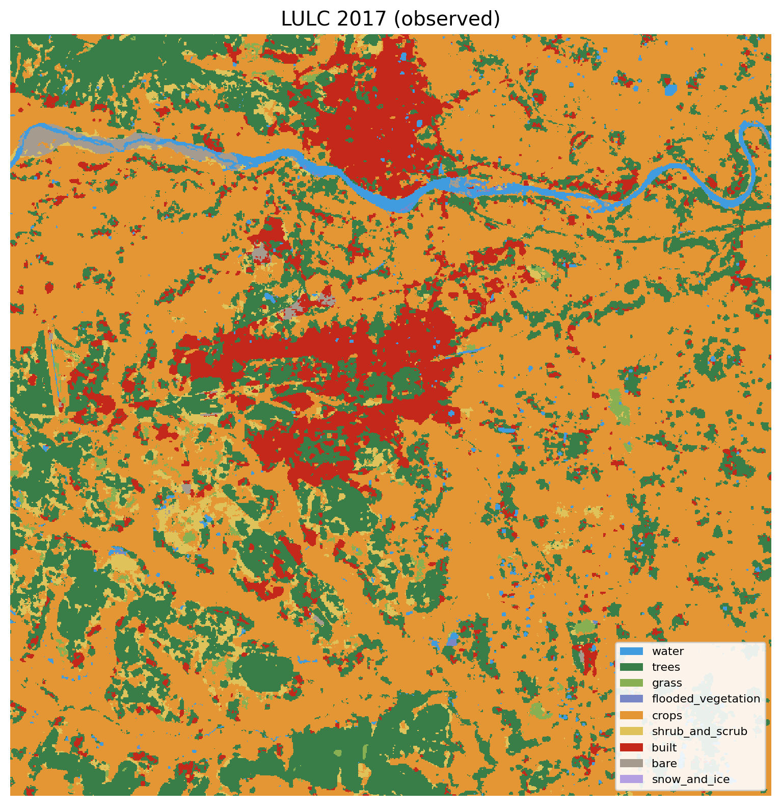
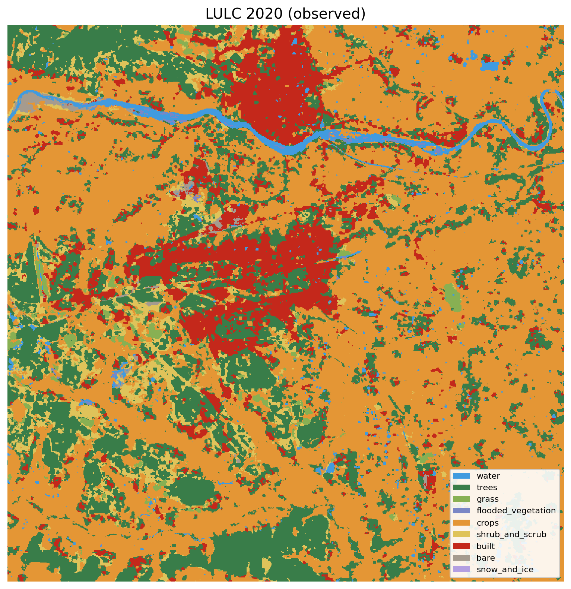
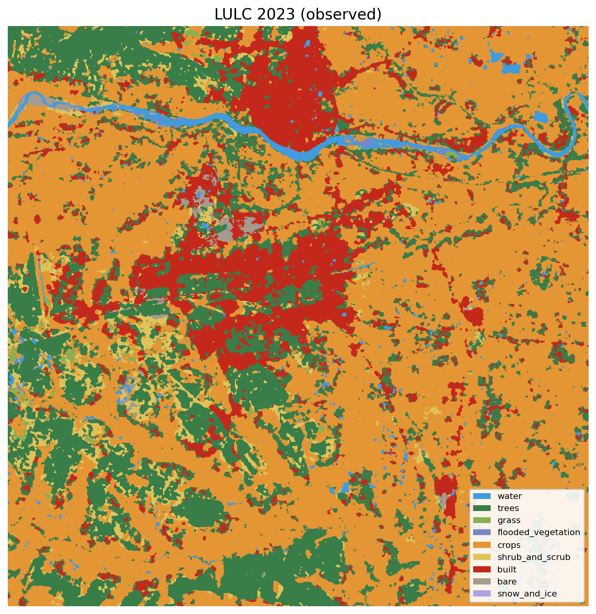
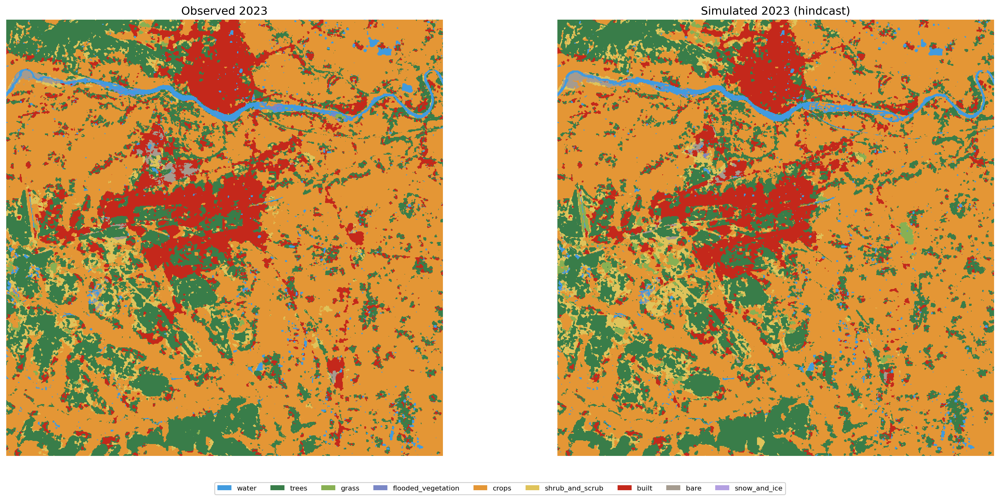
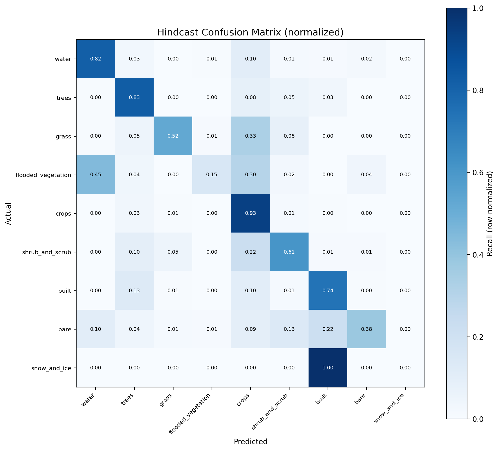

# Spatiotemporal Assessment and Simulation of Land Use and Land Cover Dynamics Using CA-ANN Modelling

**Term Project | Department of Civil Engineering, IIT Kharagpur**

**Author:** Ankit Kumar (25AG62R05)
**Supervisor:** Dr. Rajib Maity

## Overview

This project applies a **Cellular Automata - Artificial Neural Network (CA-ANN)** framework to analyze historical land use/land cover (LULC) changes and predict future land-use patterns for the **Kharagpur region, West Bengal, India**.

Based on: *Chen, L., Sun, Y., & Sajjad, S. (2018). Application and Assessment of a CA-ANN Model for Land Use Change Simulation and Multi-Temporal Prediction in Guiyang City, China. Remote Sensing, 10(10), 1560.*

## Study Area

- **Location:** Kharagpur, West Bengal, India
- **Bounding box:** 87.20°E–87.45°E, 22.20°N–22.45°N (~25 × 25 km)
- **Time periods:** 2017, 2020, 2023 (observed), 2026 (simulated)

## Key Results

| Metric | ANN Hold-out | Hindcast (2023) | Reference Paper |
|--------|-------------|-----------------|-----------------|
| Overall Accuracy | 86.84% | 86.26% | 84.42% |
| Cohen's Kappa | 0.7785 | 0.7737 | 0.73 |

- Built-up area expanded **41.9%** (71.33 → 101.19 km²) from 2017 to 2023
- 2026 simulation projects stabilization of urban growth at ~101.27 km²

## Methodology

1. **Data Acquisition** — LULC maps and 16 predictor bands from Google Earth Engine
2. **ANN Training** — MLP classifier (128-128-64 neurons) on 2017→2020 transition
3. **CA Simulation** — Weighted combination of ANN suitability (65%), neighborhood influence (30%), and stochastic perturbation (5%)
4. **Hindcast Validation** — Simulate 2023, compare with observed
5. **Future Prediction** — Iterative CA steps from 2023 to 2026

## Data Sources

| Category | Source |
|----------|--------|
| LULC | Google Dynamic World V1 |
| Spectral | Sentinel-2 SR Harmonized (6 bands + NDVI, NDBI, MNDWI) |
| Topographic | SRTM DEM (elevation, slope, aspect) |
| Socioeconomic | VIIRS Nighttime Lights |
| Distance | Distance to built-up, forest, water (from LULC) |

## Project Structure

```
├── gee_ca_ann_python_pipeline.py    # Main pipeline script (1280 lines)
├── generate_report.py               # Report generation script
├── requirements_ca_ann_gee.txt      # Python dependencies
├── term_project_plan.md             # Project plan and methodology
├── Term_Project_Report.docx         # Generated report
├── outputs/
│   ├── data/                        # Downloaded LULC rasters
│   │   ├── lulc_2017.tif
│   │   ├── lulc_2020.tif
│   │   └── lulc_2023.tif
│   ├── maps/                        # Visualization outputs (25 PNGs)
│   │   ├── lulc_*.png               # LULC classification maps
│   │   ├── change_*.png             # Change detection maps
│   │   ├── transition_*.png         # Transition matrix heatmaps
│   │   ├── ann_*.png                # ANN training curves
│   │   ├── confusion_*.png          # Confusion matrices
│   │   ├── roc_curves.png           # ROC curves
│   │   ├── pr_curves.png            # Precision-Recall curves
│   │   ├── feature_importance.png   # Feature importance
│   │   └── ...
│   ├── simulated_hindcast_2023.tif  # Hindcast validation raster
│   ├── simulated_future_2026.tif    # 2026 prediction raster
│   └── summary_metrics.json         # All metrics and results
└── .gitignore
```

## Setup and Usage

### Prerequisites

- Python 3.8+
- Google Earth Engine account (authenticated)

### Installation

```bash
pip install -r requirements_ca_ann_gee.txt
```

### Run the Pipeline

```bash
python gee_ca_ann_python_pipeline.py \
  --min-lon 87.20 --min-lat 22.20 \
  --max-lon 87.45 --max-lat 22.45 \
  --t0 2017 --t1 2020 --t2 2023 --tf 2026 \
  --outdir outputs
```

Use `--skip-download` to reuse previously downloaded data.

### Generate Report

```bash
pip install python-docx
python generate_report.py
```

## Output Highlights

### LULC Classification Maps
| 2017 | 2020 | 2023 | 2026 (Simulated) |
|------|------|------|------------------|
|  |  |  |  |

### Model Validation
| Hindcast Comparison | Confusion Matrix |
|---------------------|-----------------|
|  |  |

## Technologies

- **Python** — Single unified script, no GIS desktop software required
- **Google Earth Engine** — Cloud-based satellite data access
- **scikit-learn** — MLPClassifier for ANN
- **NumPy / SciPy** — Raster processing and CA neighborhood dynamics
- **Rasterio** — GeoTIFF I/O
- **Matplotlib** — Visualization

## License

This project was developed as an academic term project at IIT Kharagpur.
